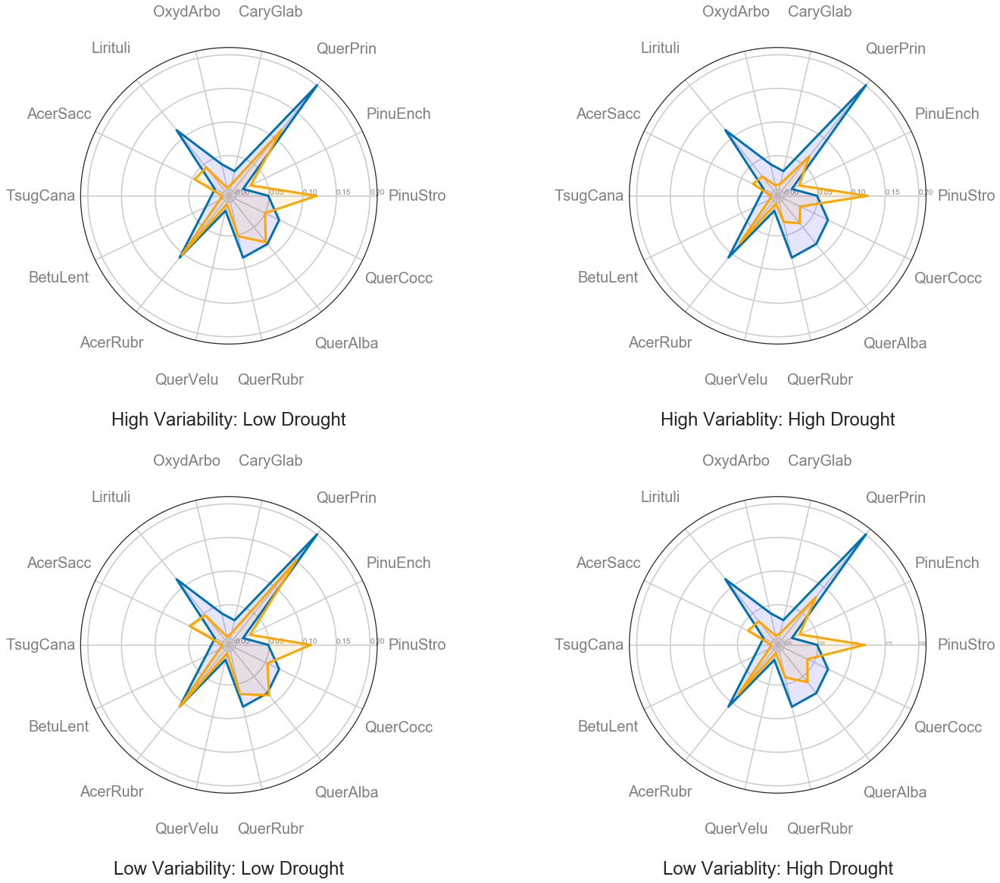
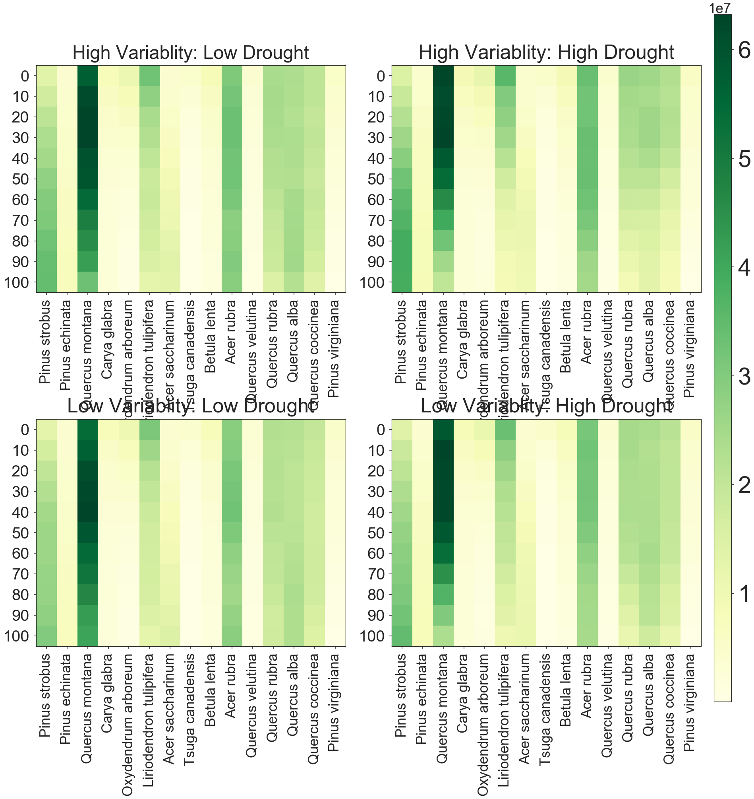
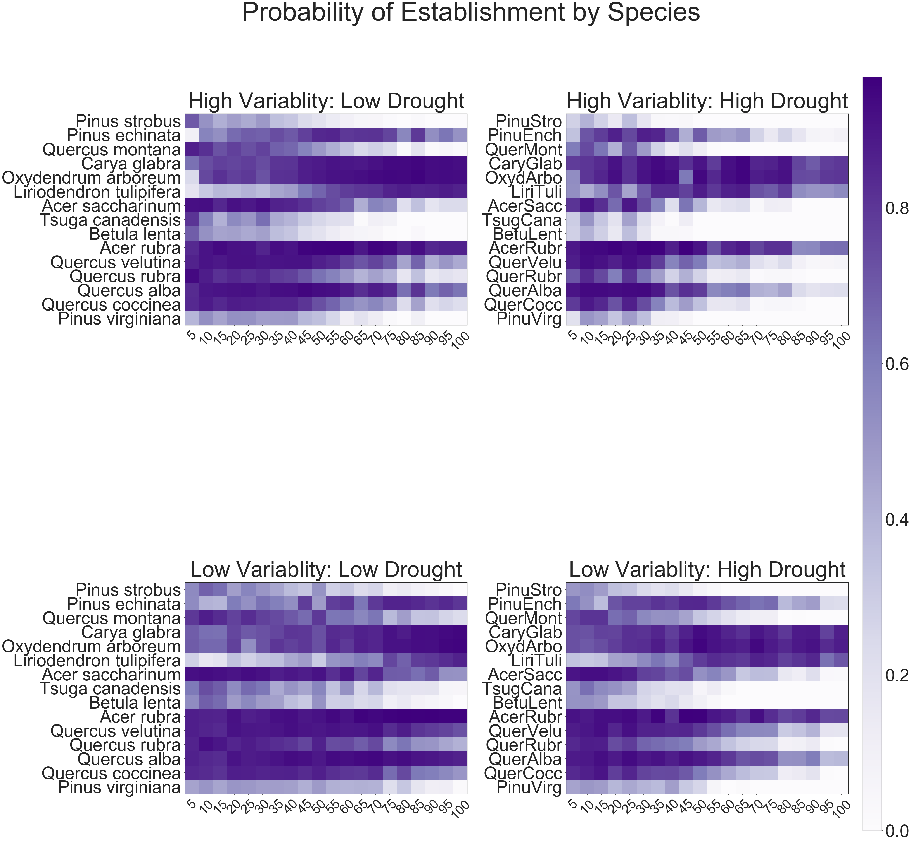
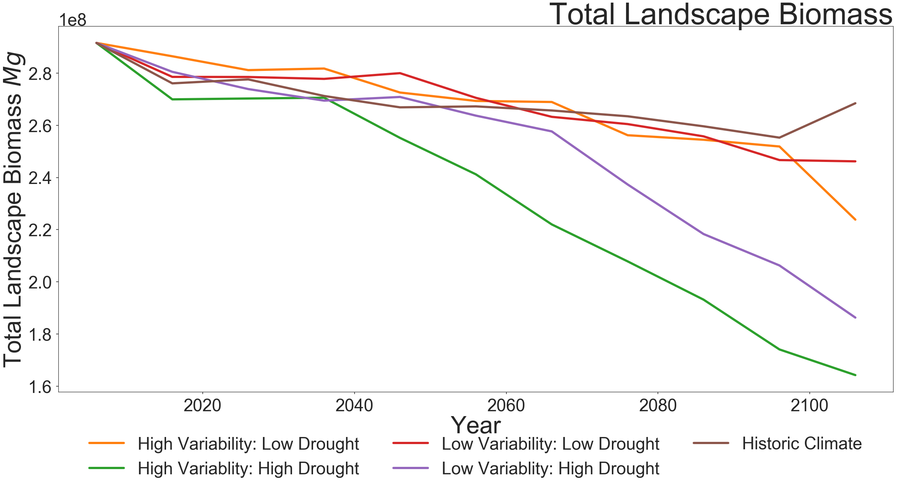
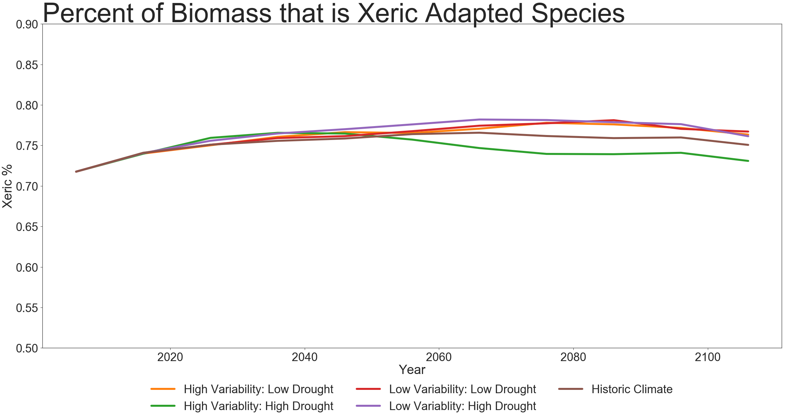
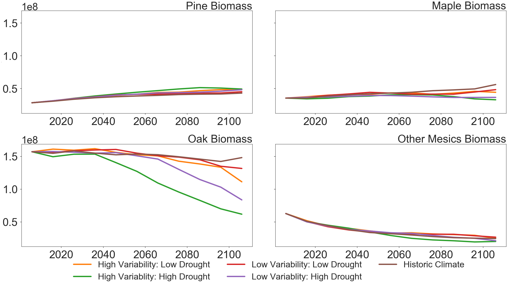
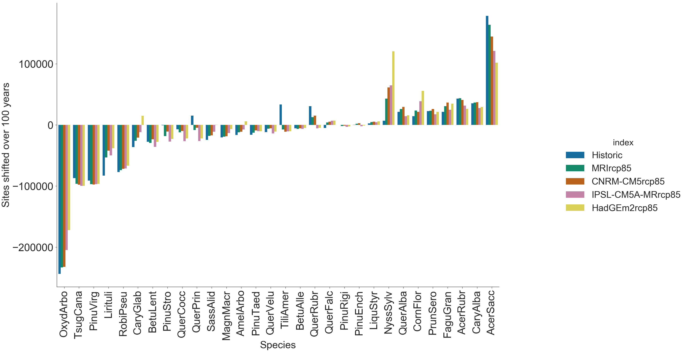
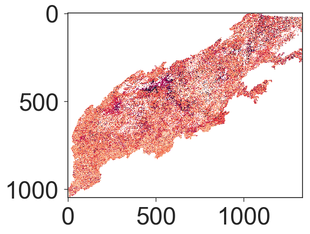
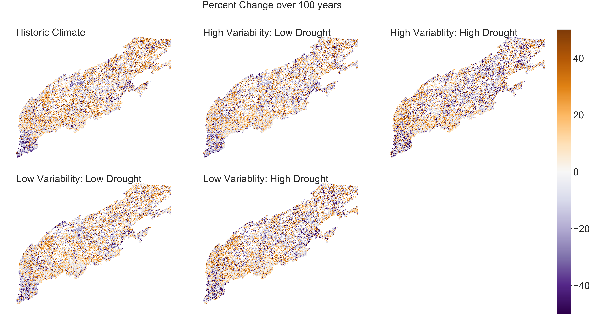
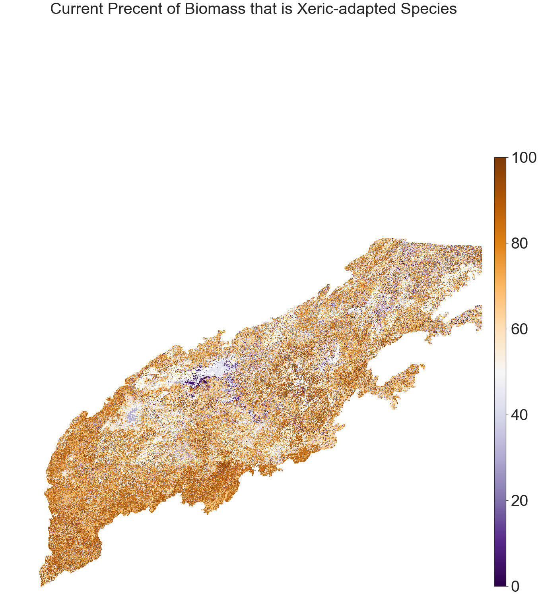

# IALE Poster Results 

Z.Robbins 5/2020
This is the script and documentation for the figures in my IALE Poster

The Influence of Drought Length and Intensity in Future Southern Appalachian Forests.
Zachary Robbins (1),  Louise Loudermilk (2), Derek Wallace (2), Steve Flanagan (3), Robert Scheller (1)
1. North Carolina State University, 2. United States Forest Service - Southern Research Station 3. Tall Timbers Research Station & Land Conservancy

DOI:


```python
##Library Set up 
import pandas as pd
import numpy as np
import rasterio as rt 
import seaborn as sns
import matplotlib.pyplot as plt
from math import pi
import os,fnmatch

### Set general minimums for graphing parameters 
SMALL_SIZE = 24
MEDIUM_SIZE =32
BIGGER_SIZE = 64
sns.set(palette="colorblind")
sns.set_style("ticks")
sns.set_context("poster")

plt.rc('font', size=SMALL_SIZE)          # controls default text sizes
plt.rc('axes', titlesize=SMALL_SIZE)     # fontsize of the axes title
plt.rc('axes', labelsize=MEDIUM_SIZE)    # fontsize of the x and y labels
plt.rc('xtick', labelsize=SMALL_SIZE)    # fontsize of the tick labels
plt.rc('ytick', labelsize=SMALL_SIZE)    # fontsize of the tick labels
plt.rc('legend', fontsize=SMALL_SIZE)    # legend fontsize
plt.rc('figure', titlesize=BIGGER_SIZE)  # fontsize of the figure ti

```


```python
## Drive where model results are located 
w_dir="E:/IALE_Results/"
### The names of the cliamte models to ID runs
Models=("CNRM-CM5rcp85","HadGEm2rcp85","MRIrcp85","IPSL-CM5A-MRrcp85","Historic")
#print(Models)
```


```python

### Set up a data frame with the years 0-100
Years=list(range(0,110,10))
### The Species names to search and pull in rasters
Species=['PiceRube','FrasFirr','PinuPung','PinuEnch','AcerPens','AcerRubr','PinuRigi',
         'PinuStro','PinuTaed','PinuVirg','TsugCana','AcerSacc','AescBuck','AmelArbo',
         'BetuAlle','BetuLent','BetuNigr','CaryCodi','CaryGlab','TiliAmhe','TiliAmer',
         'QuerStel','RobiPseu','SassAlid','QuerVelu','QuerFalc','QuerPrin','QuerRubr',
         'QuerCocc','PlanOcid','QuerAlba','PrunPenn','OxydArbo','PrunSero','NyssSylv',
         'LiquStyr','MagnAcum','MagnMacr','Lirituli','HaleDipt','IlexOpac','FaguGran',
         'FraxAmer','JuglNigr','CaryAlba','CornFlor','FraxPenn','CaryOvat']
##This is the final output bin
Alldata=pd.DataFrame()
## This loop goes through each model directory, pulls in a raster for the biomass, calculates the sum of the biomass cells 
## and indexes this as a dataframe
for Model in Models:
    AllSpecies=pd.DataFrame([[0],[10],[20],[30],[40],[50],[60],[70],[80],[90],[100]],columns=['Year'])
    ## Create a model label 
    AllSpecies["Model"]=Model
    
    Dir=w_dir+Model+'/biomass/'
    for Sp in Species:
        One_Sp=pd.DataFrame()

        for Year in Years:
            file=Dir+Sp+"-ageclass-"+str(Year)+".img"
            ## Read Raster and sum 
            One_raster=rt.open(file)
            band1=One_raster.read(1)
            Sum_Biomass=np.sum(band1)
            ## Build out dataframe
            Frame=pd.DataFrame([[Year,Sum_Biomass]],columns=['Year',Sp])
            One_Sp=One_Sp.append(Frame)
         ###Merge all species for a time/model step    
        AllSpecies=pd.merge(AllSpecies,One_Sp,how='inner', on="Year" )
        ###Merge Rows to dataframe 
    Alldata=Alldata.append(AllSpecies)

```

    C:\Users\zacha\Anaconda3\lib\site-packages\rasterio\__init__.py:193: UserWarning: Dataset has no geotransform set.  Default transform will be applied (Affine.identity())
      s.start()
    


```python
### Write to Csv for easy reset
Alldata.to_csv("AllData.csv")
```

### Individual Species 


```python
Alldata=pd.read_csv("AllData.csv")
del Alldata['Unnamed: 0']
### Covert total cell biomass/ area to biomass and from g to Mg
Alldata.iloc[:,2:52]=(Alldata.iloc[:,2:52]*62500)/1000000
Alldata.head()
```


<div>
<style scoped>
    .dataframe tbody tr th:only-of-type {
        vertical-align: middle;
    }

    .dataframe tbody tr th {
        vertical-align: top;
    }

    .dataframe thead th {
        text-align: right;
    }
</style>
<table border="1" class="dataframe">
  <thead>
    <tr style="text-align: right;">
      <th></th>
      <th>Year</th>
      <th>Model</th>
      <th>PiceRube</th>
      <th>FrasFirr</th>
      <th>PinuPung</th>
      <th>PinuEnch</th>
      <th>AcerPens</th>
      <th>AcerRubr</th>
      <th>PinuRigi</th>
      <th>PinuStro</th>
      <th>...</th>
      <th>Lirituli</th>
      <th>HaleDipt</th>
      <th>IlexOpac</th>
      <th>FaguGran</th>
      <th>FraxAmer</th>
      <th>JuglNigr</th>
      <th>CaryAlba</th>
      <th>CornFlor</th>
      <th>FraxPenn</th>
      <th>CaryOvat</th>
    </tr>
  </thead>
  <tbody>
    <tr>
      <th>0</th>
      <td>0</td>
      <td>CNRM-CM5rcp85</td>
      <td>1.094462e+06</td>
      <td>31075.9375</td>
      <td>86035.9375</td>
      <td>3.962800e+06</td>
      <td>184425.5625</td>
      <td>3.144125e+07</td>
      <td>1.116266e+06</td>
      <td>1.421296e+07</td>
      <td>...</td>
      <td>3.359713e+07</td>
      <td>839266.8750</td>
      <td>123996.8125</td>
      <td>1.985912e+06</td>
      <td>1.225732e+06</td>
      <td>75062.5000</td>
      <td>2.413856e+06</td>
      <td>277174.0625</td>
      <td>110419.0625</td>
      <td>391345.3750</td>
    </tr>
    <tr>
      <th>1</th>
      <td>10</td>
      <td>CNRM-CM5rcp85</td>
      <td>8.877771e+05</td>
      <td>26623.4375</td>
      <td>80153.2500</td>
      <td>4.430871e+06</td>
      <td>282555.9375</td>
      <td>3.285583e+07</td>
      <td>1.518382e+06</td>
      <td>1.772974e+07</td>
      <td>...</td>
      <td>2.882235e+07</td>
      <td>393708.1250</td>
      <td>101267.3750</td>
      <td>1.781641e+06</td>
      <td>1.577158e+06</td>
      <td>92379.2500</td>
      <td>2.790139e+06</td>
      <td>271807.7500</td>
      <td>196333.0625</td>
      <td>419937.4375</td>
    </tr>
    <tr>
      <th>2</th>
      <td>20</td>
      <td>CNRM-CM5rcp85</td>
      <td>7.022836e+05</td>
      <td>31473.6875</td>
      <td>62582.6250</td>
      <td>4.821284e+06</td>
      <td>408683.0000</td>
      <td>3.407378e+07</td>
      <td>1.813395e+06</td>
      <td>2.158548e+07</td>
      <td>...</td>
      <td>2.465837e+07</td>
      <td>281622.6250</td>
      <td>91603.3750</td>
      <td>1.615413e+06</td>
      <td>1.839325e+06</td>
      <td>98651.3125</td>
      <td>3.168321e+06</td>
      <td>311401.8750</td>
      <td>322374.8125</td>
      <td>439048.8125</td>
    </tr>
    <tr>
      <th>3</th>
      <td>30</td>
      <td>CNRM-CM5rcp85</td>
      <td>5.650655e+05</td>
      <td>41470.0625</td>
      <td>51223.0000</td>
      <td>5.296490e+06</td>
      <td>522996.9375</td>
      <td>3.418715e+07</td>
      <td>2.049022e+06</td>
      <td>2.417920e+07</td>
      <td>...</td>
      <td>2.326675e+07</td>
      <td>194548.6875</td>
      <td>86187.3750</td>
      <td>1.571412e+06</td>
      <td>2.009835e+06</td>
      <td>103503.3125</td>
      <td>3.944405e+06</td>
      <td>379660.0000</td>
      <td>424490.8750</td>
      <td>505440.4375</td>
    </tr>
    <tr>
      <th>4</th>
      <td>40</td>
      <td>CNRM-CM5rcp85</td>
      <td>4.703606e+05</td>
      <td>56856.0000</td>
      <td>45878.7500</td>
      <td>5.604510e+06</td>
      <td>623723.5000</td>
      <td>3.304332e+07</td>
      <td>2.182791e+06</td>
      <td>2.584491e+07</td>
      <td>...</td>
      <td>2.097091e+07</td>
      <td>126086.7500</td>
      <td>78363.7500</td>
      <td>1.514175e+06</td>
      <td>2.043500e+06</td>
      <td>91619.1875</td>
      <td>4.387219e+06</td>
      <td>415247.8750</td>
      <td>466127.7500</td>
      <td>546591.2500</td>
    </tr>
  </tbody>
</table>
<p>5 rows × 50 columns</p>
</div>


```python

## Get a sample model to pull in the most prevelant inital species
OneModel=Alldata.loc[Alldata.Model=="CNRM-CM5rcp85"]
##Time0
Time0=OneModel.loc[OneModel.Year==0]
## Melt values
Melt=pd.melt(Time0,id_vars=['Year'])
Melt=Melt[1:]
Melt['value']=pd.to_numeric(Melt.value)
### Get a total Landscape Sum
TotalBiomass=Melt['value'].sum()
## Get top 15 species
TopSp=Melt.nlargest(15,columns='value')
## Arrange From xeric to mesic in a circle by index
indexorder=[8,4,27,19,33,39,12,11,16,6,25,28,31,29]
TopSp=TopSp.reindex(indexorder)
## Calculate landscape precentage. 
TopSp['Percent']=TopSp['value']/TotalBiomass

## This function does the as above when fed a year, the model name, and the dataframe.
def ProcessForSpider(Year,model,data):
    OneModel=data.loc[data.Model==model]
    Time100=OneModel.loc[OneModel.Year==Year]
   
    Melt100=pd.melt(Time100,id_vars=['Year'])
    Melt100=Melt100[1:]
    Melt100['value']=pd.to_numeric(Melt100.value)
    TotalBiomass100=Melt100['value'].sum()
   
    TopSp100=Melt100[Melt100.variable.isin(TopSp.variable)]
    ## PineStro,PinuEnch QuerPrin,ClaryGlaba,OxyArbo,LiriTuli,AcerSacc,TsugCana,BetulaLent,AcerRubra,QuerVelu,QuerRubr, QuerAlba, QuerCocc,PinuVirg,
    
    TopSp100=TopSp100.reindex(TopSp.index)
    TopSp100['Percent']=TopSp100['value']/TotalBiomass
    return(TopSp100)
print(ProcessForSpider(100,"CNRM-CM5rcp85",Alldata).head())

```

        Year  variable         value   Percent
    8    100  PinuStro  3.518820e+07  0.120670
    4    100  PinuEnch  7.609495e+06  0.026095
    27   100  QuerPrin  3.386948e+07  0.116148
    19   100  CaryGlab  2.398842e+06  0.008226
    33   100  OxydArbo  7.411681e+05  0.002542
    


```python
### This is a set up for a spider/radarplot 
### It is modified from this https://python-graph-gallery.com/391-radar-chart-with-several-individuals/

## This defines the shape of the plot using the time 0 variables 
N = len(TopSp.variable)
categories=TopSp.variable
values=TopSp.Percent.values.flatten().tolist()
values += values[:1]
#values
angles = [n / float(N) * 2 * pi for n in range(N)]
angles += angles[:1]
angles
#categories


## In this figure we are comparing the time 0 of all models with 100 year ouput for each individual 
## plot as a Spider plot. The value is processed in the plot by the function ProcessForSpide


###Set figure parameters 
fig= plt.figure(figsize=(20,20))
fig.tight_layout()

## sub 1 
ax = fig.add_subplot(221, polar=True)
ax.tick_params(axis='x', pad=40)
plt.xticks(angles[:-1], categories, color='grey', size=20)
##Plot Time zero variables 
ax.plot(angles, values, linewidth=3, linestyle='solid')
ax.fill(angles, values, 'b', alpha=0.1)
ax.set_rlabel_position(0)
plt.yticks(color="grey", size=10)
##Plot Time Hundred variables 
TopSp100=ProcessForSpider(100,Models[0],Alldata)
values=TopSp100.Percent.values.flatten().tolist()
values += values[:1]
ax.plot(angles, values, linewidth=3,color='orange', linestyle='solid')
ax.fill(angles, values, 'orange', alpha=0.1)
ax.set_title("High Variability: Low Drought", va='bottom',y=-0.3)

#sub2
ax = fig.add_subplot(222, polar=True)
ax.tick_params(axis='x', pad=40)
plt.xticks(angles[:-1], categories, color='grey', size=20)
values=TopSp.Percent.values.flatten().tolist()
values += values[:1]
ax.plot(angles, values, linewidth=3, linestyle='solid')
ax.fill(angles, values, 'b', alpha=0.1)
ax.set_rlabel_position(0)
plt.yticks(color="grey", size=10)
##Plot Time Hundred variables 
TopSp100=ProcessForSpider(100,Models[1],Alldata)
values=TopSp100.Percent.values.flatten().tolist()
values += values[:1]
ax.plot(angles, values, linewidth=3,color='orange', linestyle='solid')
ax.fill(angles, values, 'orange', alpha=0.1)
ax.set_title("High Variablity: High Drought", va='bottom',y=-0.3)

#sub3
ax = fig.add_subplot(223, polar=True)
ax.tick_params(axis='x', pad=40)
TopSp100=ProcessForSpider(100,Models[2],Alldata)
plt.xticks(angles[:-1], categories, color='grey', size=20)
values=TopSp.Percent.values.flatten().tolist()
values += values[:1]
ax.plot(angles, values, linewidth=3, linestyle='solid')
ax.fill(angles, values, 'b', alpha=0.1)
ax.set_rlabel_position(0)
plt.yticks(color="grey", size=10)
##Plot Time Hundred variables 
values=TopSp100.Percent.values.flatten().tolist()
values += values[:1]
ax.plot(angles, values, linewidth=3,color='orange', linestyle='solid')
ax.fill(angles, values, 'orange', alpha=0.1)
ax.set_title("Low Variability: Low Drought", va='bottom',y=-0.3)

#sub4
ax = fig.add_subplot(224, polar=True)
ax.tick_params(axis='x', pad=40)
TopSp100=ProcessForSpider(100,Models[3],Alldata)
plt.xticks(angles[:-1], categories, color='grey', size=20)
values=TopSp.Percent.values.flatten().tolist()
values += values[:1]
ax.plot(angles, values, linewidth=3, linestyle='solid')
ax.fill(angles, values, 'b', alpha=0.1)
ax.set_rlabel_position(0)
plt.yticks(color="grey", size=5)
##Plot Time Hundred variables 
values=TopSp100.Percent.values.flatten().tolist()
values += values[:1]
ax.plot(angles, values, linewidth=3,color='orange', linestyle='solid')
ax.fill(angles, values, 'orange', alpha=0.1)
ax.set_title("Low Variablity: High Drought", va='bottom',y=-0.3)

#ax = plt.subplot(122, polar=True)
fig.subplots_adjust(wspace = .85)
#plt.margins(0,0)
#fig.savefig("Radarplot.svg",format='svg',dpi=1200)
```





#### Data as Rasters 


```python
### Cleaning up some naming conventions
Alldata=Alldata.rename(columns={"PinuStro":"Pinus strobus","PinuEnch":"Pinus echinata"
               ,"QuerPrin":"Quercus montana","CaryGlab":"Carya glabra",
               "OxydArbo":"Oxydendrum arboreum","Lirituli":"Liriodendron tulipifera",
               "AcerSacc":"Acer saccharinum","TsugCana":"Tsuga canadensis","BetuLent":"Betula lenta",
               "AcerRubr":"Acer rubra","QuerVelu":"Quercus velutina","QuerRubr":"Quercus rubra", 
               "QuerAlba":"Quercus alba", "QuerCocc":"Quercus coccinea","PinuVirg":"Pinus virginiana"})

Speciesnames=["Pinus strobus","Pinus echinata","Quercus montana","Carya glabra","Oxydendrum arboreum","Liriodendron tulipifera",
              "Acer saccharinum",
              "Tsuga canadensis","Betula lenta","Acer rubra","Quercus velutina","Quercus rubra", 
              "Quercus alba", "Quercus coccinea","Pinus virginiana"]

Models=Alldata.Model.unique()


fig= plt.figure(figsize=(30,30))
fig.tight_layout()
## Sub 1 
fig.add_subplot(221)
plt.title("High Variablity: Low Drought",fontsize=47,y=1.02)
OneModel=Alldata.loc[Alldata.Model==Models[0]]
Plting=OneModel[Speciesnames]
plt.imshow(Plting, cmap=plt.cm.YlGn);
plt.xticks(range(len(Speciesnames)),Speciesnames,rotation=90,size=35);
plt.yticks(range(len(OneModel.Year)),OneModel.Year,size=40)
# Sub 2
fig.add_subplot(222)
plt.title("High Variablity: High Drought",fontsize=50,y=1.02)
OneModel=Alldata.loc[Alldata.Model==Models[1]]
Plting=OneModel[Speciesnames]
plt.imshow(Plting, cmap=plt.cm.YlGn);
plt.xticks(range(len(Speciesnames)),Speciesnames,rotation=90,size=35);
plt.yticks(range(len(OneModel.Year)),OneModel.Year,size=40)
#Sub 3
fig.add_subplot(223)
plt.title("Low Variablity: Low Drought",fontsize=50,y=1.02)
OneModel=Alldata.loc[Alldata.Model==Models[2]]
Plting=OneModel[Speciesnames]
plt.imshow(Plting, cmap=plt.cm.YlGn);
plt.xticks(range(len(Speciesnames)),Speciesnames,rotation=90,size=35);
plt.yticks(range(len(OneModel.Year)),OneModel.Year,size=40)
#Sub 4
fig.add_subplot(224)
plt.title("Low Variablity: High Drought",fontsize=50,y=1.02)
OneModel=Alldata.loc[Alldata.Model==Models[3]]
Plting=OneModel[Speciesnames]
plt.imshow(Plting, cmap=plt.cm.YlGn);
plt.xticks(range(len(Speciesnames)),Speciesnames,rotation=90,size=35);
plt.yticks(range(len(OneModel.Year)),OneModel.Year,size=40)
### Color bar Set up 
im=plt.imshow(Plting, cmap=plt.cm.YlGn);
cb_ax = fig.add_axes([0.915, 0.1, 0.02, 0.8])
cbar = fig.colorbar(im, cax=cb_ax)
cbar.ax.tick_params(labelsize=60) 
cbar.ax.yaxis.offsetText.set_fontsize(35)
fig.subplots_adjust(wspace = .15, right=.90)

plt.show()
###fig.savefig("Colormap.png",format='png',dpi=100)
```





```python
## For the probability of establishment map we need to use the NECN-prob-establishment.csv produced from LANDIS-II
## 

w_dir="E:/IALE_Results/"
## Set up a sample model 
Model=Models[1]
### Set species names and clean up conventions. 
Speciesnames=["PinuStro","PinuEnch","QuerPrin","CaryGlab","OxydArbo","LiriTuli","AcerSacc",
              "TsugCana","BetuLent","AcerRubr","QuerVelu","QuerRubr", "QuerAlba", "QuerCocc","PinuVirg"]
Specieslabel=["Pinus strobus","Pinus echinata","Quercus montana","Carya glabra","Oxydendrum arboreum","Liriodendron tulipifera",
              "Acer saccharinum",
              "Tsuga canadensis","Betula lenta","Acer rubra","Quercus velutina","Quercus rubra", 
              "Quercus alba", "Quercus coccinea","Pinus virginiana"]
Speciesnames2=["PinuStro","PinuEnch","QuerMont","CaryGlab","OxydArbo","LiriTuli","AcerSacc",
              "TsugCana","BetuLent","AcerRubr","QuerVelu","QuerRubr", "QuerAlba", "QuerCocc","PinuVirg"]

## This function grabs the prob-establishment log, groups across the ecoretions, and takes the mean
## Then it returns a plottable dataframe with the Time Species and Probability of Establishment. 

def sortingProbEst(Model,Species):
    model_dir=w_dir+Model
    Prob_csv=pd.read_csv(model_dir+"/NECN-prob-establish-log.csv")
    grouped=Prob_csv.groupby(['Time',' Species'],as_index=False)[' AvgProbEst'].mean()
    TopSp=grouped[grouped[' Species'].isin(Species)]
    
    PlotTen=TopSp.pivot(index="Time",
          columns=" Species",
          values=" AvgProbEst")
    PlotTen=PlotTen.reindex(columns=Species) 
    PlotTen=PlotTen.rename(columns={"QuerPrin":"QuerMont"})

    return(PlotTen)
sortingProbEst(Model,Speciesnames).T.head()
```


<div>
<style scoped>
    .dataframe tbody tr th:only-of-type {
        vertical-align: middle;
    }

    .dataframe tbody tr th {
        vertical-align: top;
    }

    .dataframe thead th {
        text-align: right;
    }
</style>
<table border="1" class="dataframe">
  <thead>
    <tr style="text-align: right;">
      <th>Time</th>
      <th>5</th>
      <th>10</th>
      <th>15</th>
      <th>20</th>
      <th>25</th>
      <th>30</th>
      <th>35</th>
      <th>40</th>
      <th>45</th>
      <th>50</th>
      <th>55</th>
      <th>60</th>
      <th>65</th>
      <th>70</th>
      <th>75</th>
      <th>80</th>
      <th>85</th>
      <th>90</th>
      <th>95</th>
      <th>100</th>
    </tr>
    <tr>
      <th>Species</th>
      <th></th>
      <th></th>
      <th></th>
      <th></th>
      <th></th>
      <th></th>
      <th></th>
      <th></th>
      <th></th>
      <th></th>
      <th></th>
      <th></th>
      <th></th>
      <th></th>
      <th></th>
      <th></th>
      <th></th>
      <th></th>
      <th></th>
      <th></th>
    </tr>
  </thead>
  <tbody>
    <tr>
      <th>PinuStro</th>
      <td>0.2795</td>
      <td>0.3994</td>
      <td>0.2722</td>
      <td>0.1424</td>
      <td>0.3523</td>
      <td>0.1694</td>
      <td>0.0334</td>
      <td>0.0257</td>
      <td>0.0309</td>
      <td>0.0000</td>
      <td>0.0000</td>
      <td>0.0000</td>
      <td>0.0000</td>
      <td>0.0000</td>
      <td>0.0000</td>
      <td>0.0000</td>
      <td>0.0000</td>
      <td>0.0000</td>
      <td>0.0000</td>
      <td>0.0000</td>
    </tr>
    <tr>
      <th>PinuEnch</th>
      <td>0.3406</td>
      <td>0.7133</td>
      <td>0.7814</td>
      <td>0.8647</td>
      <td>0.7491</td>
      <td>0.8684</td>
      <td>0.8470</td>
      <td>0.7102</td>
      <td>0.4140</td>
      <td>0.6942</td>
      <td>0.4770</td>
      <td>0.4589</td>
      <td>0.5002</td>
      <td>0.2701</td>
      <td>0.1493</td>
      <td>0.2716</td>
      <td>0.1680</td>
      <td>0.0684</td>
      <td>0.0556</td>
      <td>0.0794</td>
    </tr>
    <tr>
      <th>QuerMont</th>
      <td>0.6015</td>
      <td>0.7417</td>
      <td>0.6227</td>
      <td>0.4075</td>
      <td>0.7041</td>
      <td>0.4811</td>
      <td>0.2722</td>
      <td>0.1313</td>
      <td>0.2103</td>
      <td>0.1207</td>
      <td>0.0047</td>
      <td>0.0001</td>
      <td>0.0029</td>
      <td>0.0000</td>
      <td>0.0000</td>
      <td>0.0000</td>
      <td>0.0000</td>
      <td>0.0000</td>
      <td>0.0000</td>
      <td>0.0000</td>
    </tr>
    <tr>
      <th>CaryGlab</th>
      <td>0.7842</td>
      <td>0.8006</td>
      <td>0.8338</td>
      <td>0.9089</td>
      <td>0.8135</td>
      <td>0.9021</td>
      <td>0.9333</td>
      <td>0.9025</td>
      <td>0.8156</td>
      <td>0.9002</td>
      <td>0.7826</td>
      <td>0.9177</td>
      <td>0.9488</td>
      <td>0.8467</td>
      <td>0.8576</td>
      <td>0.9044</td>
      <td>0.7575</td>
      <td>0.6983</td>
      <td>0.7764</td>
      <td>0.7935</td>
    </tr>
    <tr>
      <th>OxydArbo</th>
      <td>0.5342</td>
      <td>0.7986</td>
      <td>0.8496</td>
      <td>0.9186</td>
      <td>0.8140</td>
      <td>0.9071</td>
      <td>0.9444</td>
      <td>0.9290</td>
      <td>0.6107</td>
      <td>0.9375</td>
      <td>0.8389</td>
      <td>0.9232</td>
      <td>0.9503</td>
      <td>0.8728</td>
      <td>0.8948</td>
      <td>0.9113</td>
      <td>0.7429</td>
      <td>0.7390</td>
      <td>0.7912</td>
      <td>0.7982</td>
    </tr>
  </tbody>
</table>
</div>


```python
## Create a figure 
fig= plt.figure(figsize=(60,60))
fig.tight_layout()

#sub 1
fig.add_subplot(221)
plt.title("High Variablity: Low Drought",fontsize=100,y=1.02)
OneModel=sortingProbEst(Models[0],Speciesnames)
plt.imshow(OneModel.T, cmap=plt.cm.Purples);
plt.yticks(range(len(Specieslabel)),Specieslabel,size=80);
plt.xticks(range(len(OneModel.index)),OneModel.index,size=60,rotation=45)
fig.tight_layout()
# sub 2
fig.add_subplot(222)
plt.title("High Variablity: High Drought",fontsize=100,y=1.02)
OneModel=sortingProbEst(Models[1],Speciesnames)
plt.imshow(OneModel.T, cmap=plt.cm.Purples);
plt.yticks(range(len(Speciesnames)),Speciesnames2,size=80);
plt.xticks(range(len(OneModel.index)),OneModel.index,size=60,rotation=45)
# sub 3
fig.add_subplot(223)
plt.title("Low Variablity: Low Drought",fontsize=100,y=1.02)
OneModel=sortingProbEst(Models[2],Speciesnames)
plt.imshow(OneModel.T, cmap=plt.cm.Purples);
plt.yticks(range(len(Specieslabel)),Specieslabel,size=80);
plt.xticks(range(len(OneModel.index)),OneModel.index,size=60,rotation=45)
# sub 4
fig.add_subplot(224)
plt.title("Low Variablity: High Drought",fontsize=100,y=1.02)
OneModel=sortingProbEst(Models[3],Speciesnames)
plt.imshow(OneModel.T, cmap=plt.cm.Purples,origin="lower");
plt.yticks(range(len(Speciesnames)),Speciesnames2,size=80);
plt.xticks(range(len(OneModel.index)),OneModel.index,size=60,rotation=45)


### Color bar Set up 
im=plt.imshow(OneModel.T, cmap=plt.cm.Purples);
cb_ax = fig.add_axes([0.915, 0.1, 0.02, 0.8])
cbar = fig.colorbar(im, cax=cb_ax)
cbar.ax.tick_params(labelsize=80) 
cbar.ax.yaxis.offsetText.set_fontsize(90)
fig.subplots_adjust(wspace = .35,hspace=.0 ,right=.90)
fig.suptitle('Probability of Establishment by Species',size=120)
plt.show()
#fig.savefig("ColormapEstablishment.png",format='png',dpi=100)

```





## Landscape Metrics


```python


## Set some larger plotting defualts. 
SMALL_SIZE = 46
MEDIUM_SIZE =64
BIGGER_SIZE = 86
sns.set(palette="colorblind")
sns.set_style("ticks")
sns.set_context("poster")

plt.rc('font', size=SMALL_SIZE)          # controls default text sizes
plt.rc('axes', titlesize=SMALL_SIZE)     # fontsize of the axes title
plt.rc('axes', labelsize=MEDIUM_SIZE)    # fontsize of the x and y labels
plt.rc('xtick', labelsize=SMALL_SIZE)    # fontsize of the tick labels
plt.rc('ytick', labelsize=SMALL_SIZE)    # fontsize of the tick labels
plt.rc('legend', fontsize=SMALL_SIZE)    # legend fontsize
plt.rc('figure', titlesize=BIGGER_SIZE)  # fontsize of the figure ti

## Here we define the alternate model names, This was done manually above
ModelNames=("High Variability: Low Drought","High Variablity: High Drought",
           "Low Variability: Low Drought","Low Variablity: High Drought", "Historic Climate")


### Take the row sum of each time/model row to get the total biomass at that time for that model 
TotalBiomass=Alldata.iloc[:,2:50].sum(axis=1)
Alldata['TotalBiomass']=TotalBiomass
## Just grab that data
ShortPlotter=Alldata[['Year','Model','TotalBiomass']]
## Create a consistant color pallette
colors=plt.cm.tab10([0,.1,.2,.3,.4,.5,.6,.7,.8,.9,1.0])

## Plotting the figure 
fig= plt.figure(figsize=(40,20))
### Creating more room at the bottom 
plt.gcf().subplots_adjust(bottom=0.2)

plt.plot(2006+Alldata.loc[Alldata.Model==Models[0]]['Year'],Alldata.loc[Alldata.Model==Models[0]]['TotalBiomass'],linewidth=6,color=colors[1])
plt.plot(2006+Alldata.loc[Alldata.Model==Models[1]]['Year'],Alldata.loc[Alldata.Model==Models[1]]['TotalBiomass'],linewidth=6,color=colors[2])
plt.plot(2006+Alldata.loc[Alldata.Model==Models[2]]['Year'],Alldata.loc[Alldata.Model==Models[2]]['TotalBiomass'],linewidth=6,color=colors[3])
plt.plot(2006+Alldata.loc[Alldata.Model==Models[3]]['Year'],Alldata.loc[Alldata.Model==Models[3]]['TotalBiomass'],linewidth=6,color=colors[4])
plt.plot(2006+Alldata.loc[Alldata.Model==Models[4]]['Year'],Alldata.loc[Alldata.Model==Models[4]]['TotalBiomass'],linewidth=6,color=colors[5])

plt.title("Total Landscape Biomass",size=80,loc="right")
plt.ylabel("Total Landscape Biomass $Mg$")
plt.xlabel("Year")
plt.legend(ModelNames,loc='upper center', bbox_to_anchor=(0.5, -0.08), fancybox=True, shadow=True, ncol=3)


#fig.savefig("TotalBiomass.png",format='png',dpi=600)
```


    <matplotlib.legend.Legend at 0x2821f9ef940>





```python
### Comparing Xeric versus Mesic biomass. Here we do the same thing as above, except we subset the dataframe first
## by wether a species is xeric or mesic. 
Alldata=pd.read_csv("AllData.csv")
del Alldata['Unnamed: 0']
Alldata['TotalBiomass']=TotalBiomass
## Define Mesic and Xeric Species
Mesic=['AcerPens','AcerRubr','AcerSacc','BetuAlle','BetuLent','BetuNigr',
      'CornFlor','LiriTuli',
       'MagnMacr','NyssSylv','TsugCana','PrunSero',"BetuLent","FraxAmer",
      'TiliAmhe','TiliAmer','RobiPseu','SassAlid','PlanOcid','PrunPenn',
      'LiquStyr','MagnAcum','MagnMacr','HaleDipt','IlexOpac','FraxAmer',
      'JuglNigr','FraxPenn']

Xeric=["CaryAlba",'CaryCodi','PinuPung','CaryGlab','CaryOvat','FrasFirr','OxydArbo',
      'PinuEnch','PinuPung','QuerAlba','PinuRigi','QuerCocc','PinuStro',
      'PinuTaed','PinuVirg','QuerAlba', 'QuerPrin','QuerRubr',
      'QuerStel','QuerVelu','FraxPenn','PiceRube']

### Total Biomass
TotalBiomass=Alldata.sum()

##Xeric Biomass
XericBio=Alldata[Xeric]
TotalBiomass=XericBio.sum(axis=1)
XericBio['TotalBiomass']=TotalBiomass
XericBio['Year']=Alldata.Year
XericBio['Model']=Alldata.Model
XericBio=XericBio[['Year','Model','TotalBiomass']]
## Calculate the percentage
XericBio['Percentage']=XericBio['TotalBiomass']/Alldata['TotalBiomass']

## Plot the figure 
fig= plt.figure(figsize=(40,20))
plt.gcf().subplots_adjust(bottom=0.2)
plt.plot(2006+XericBio.loc[XericBio.Model==Models[1]]['Year'],XericBio.loc[XericBio.Model==Models[0]]['Percentage'],linewidth=6,color=colors[1])
plt.plot(2006+XericBio.loc[XericBio.Model==Models[1]]['Year'],XericBio.loc[XericBio.Model==Models[1]]['Percentage'],linewidth=6,color=colors[2])
plt.plot(2006+XericBio.loc[XericBio.Model==Models[1]]['Year'],XericBio.loc[XericBio.Model==Models[2]]['Percentage'],linewidth=6,color=colors[3])
plt.plot(2006+XericBio.loc[XericBio.Model==Models[1]]['Year'],XericBio.loc[XericBio.Model==Models[3]]['Percentage'],linewidth=6,color=colors[4])
plt.plot(2006+XericBio.loc[XericBio.Model==Models[1]]['Year'],XericBio.loc[XericBio.Model==Models[4]]['Percentage'],linewidth=6,color=colors[5])
plt.title("Percent of Biomass that is Xeric Adapted Species",size=80,loc="left")
plt.axis((None,None,.5,.9))
plt.ylabel("Xeric $\% $")
plt.xlabel("Year")
plt.legend(ModelNames,loc='upper center', bbox_to_anchor=(0.5, -0.08), fancybox=True, shadow=True, ncol=3)
#fig.savefig("Xeric.png",format='png',dpi=600)
```

    C:\Users\zacha\Anaconda3\lib\site-packages\ipykernel_launcher.py:25: SettingWithCopyWarning: 
    A value is trying to be set on a copy of a slice from a DataFrame.
    Try using .loc[row_indexer,col_indexer] = value instead
    
    See the caveats in the documentation: http://pandas.pydata.org/pandas-docs/stable/indexing.html#indexing-view-versus-copy
    C:\Users\zacha\Anaconda3\lib\site-packages\ipykernel_launcher.py:26: SettingWithCopyWarning: 
    A value is trying to be set on a copy of a slice from a DataFrame.
    Try using .loc[row_indexer,col_indexer] = value instead
    
    See the caveats in the documentation: http://pandas.pydata.org/pandas-docs/stable/indexing.html#indexing-view-versus-copy
    C:\Users\zacha\Anaconda3\lib\site-packages\ipykernel_launcher.py:27: SettingWithCopyWarning: 
    A value is trying to be set on a copy of a slice from a DataFrame.
    Try using .loc[row_indexer,col_indexer] = value instead
    
    See the caveats in the documentation: http://pandas.pydata.org/pandas-docs/stable/indexing.html#indexing-view-versus-copy
    


    <matplotlib.legend.Legend at 0x2821f6a40b8>





```python
### Reread data to remove all the edits 
Alldata=pd.read_csv("AllData.csv")
del Alldata['Unnamed: 0']
## Recalculate the total biomass. 
Alldata.iloc[:,2:52]=(Alldata.iloc[:,2:52]*62500)/1000000
## Set up categories
Pine=['PinuEnch','PinuPung','PinuRigi','PinuStro','PinuTaed','PinuVirg']

Oak=['QuerAlba','QuerAlba', 'QuerPrin','QuerRubr','QuerStel','QuerVelu','QuerCocc']

Maples=['AcerPens','AcerRubr','AcerSacc']

OtherMesics=['BetuAlle','BetuLent','CornFlor','Lirituli','MagnMacr','NyssSylv','TsugCana','CornFlor',
      "FraxAmer",'TiliAmhe','TiliAmer','RobiPseu','SassAlid','PlanOcid','PrunPenn',
      'LiquStyr','HaleDipt','IlexOpac','JuglNigr','FraxPenn']

### This function works the same as the parser above in the Xeric/Mesic example 
### It takes the dataset and a list of tree names as the inputs 

def biomassparser(Alldata,TreeSet):
    SetBio=Alldata[TreeSet]
    TotalBiomass=SetBio.sum(axis=1)
    SetBio['TotalBiomass']=TotalBiomass
    SetBio['Year']=Alldata.Year
    SetBio['Model']=Alldata.Model
    SetBio=SetBio[['Year','Model','TotalBiomass']]
    return(SetBio)
PineTotal=biomassparser(Alldata,Pine)
OakTotal=biomassparser(Alldata,Oak)
MaplesTotal=biomassparser(Alldata,Maples)
OtherMesics=biomassparser(Alldata,OtherMesics)


## Plotting the figure. 
fig, ((ax1, ax2),(ax3,ax4)) = plt.subplots(ncols=2, nrows=2,figsize=(40, 20), sharey=True)
ax1.xaxis.set_tick_params(labelsize=50)
ax1.yaxis.set_tick_params(labelsize=50)
ax2.xaxis.set_tick_params(labelsize=50)
ax2.yaxis.set_tick_params(labelsize=50)
ax3.xaxis.set_tick_params(labelsize=50)
ax3.yaxis.set_tick_params(labelsize=50)
ax4.xaxis.set_tick_params(labelsize=50)
ax4.yaxis.set_tick_params(labelsize=50)
## Pines 
ax1.plot(2006+PineTotal.loc[PineTotal.Model==Models[1]]['Year'],PineTotal.loc[PineTotal.Model==Models[0]]['TotalBiomass'],linewidth=6,color=colors[1])
ax1.plot(2006+PineTotal.loc[PineTotal.Model==Models[1]]['Year'],PineTotal.loc[PineTotal.Model==Models[1]]['TotalBiomass'],linewidth=6,color=colors[2])
ax1.plot(2006+PineTotal.loc[PineTotal.Model==Models[1]]['Year'],PineTotal.loc[PineTotal.Model==Models[2]]['TotalBiomass'],linewidth=6,color=colors[3])
ax1.plot(2006+PineTotal.loc[PineTotal.Model==Models[1]]['Year'],PineTotal.loc[PineTotal.Model==Models[3]]['TotalBiomass'],linewidth=6,color=colors[4])
ax1.plot(2006+PineTotal.loc[PineTotal.Model==Models[1]]['Year'],PineTotal.loc[PineTotal.Model==Models[4]]['TotalBiomass'],linewidth=6,color=colors[5])
ax1.set_ylabel("Mg Biomass",size=0)
## Maples
ax2.plot(2006+MaplesTotal.loc[MaplesTotal.Model==Models[1]]['Year'],MaplesTotal.loc[MaplesTotal.Model==Models[0]]['TotalBiomass'],linewidth=6,color=colors[1])
ax2.plot(2006+MaplesTotal.loc[MaplesTotal.Model==Models[1]]['Year'],MaplesTotal.loc[MaplesTotal.Model==Models[1]]['TotalBiomass'],linewidth=6,color=colors[2])
ax2.plot(2006+MaplesTotal.loc[MaplesTotal.Model==Models[1]]['Year'],MaplesTotal.loc[MaplesTotal.Model==Models[2]]['TotalBiomass'],linewidth=6,color=colors[3])
ax2.plot(2006+MaplesTotal.loc[MaplesTotal.Model==Models[1]]['Year'],MaplesTotal.loc[MaplesTotal.Model==Models[3]]['TotalBiomass'],linewidth=6,color=colors[4])
ax2.plot(2006+MaplesTotal.loc[MaplesTotal.Model==Models[1]]['Year'],MaplesTotal.loc[MaplesTotal.Model==Models[4]]['TotalBiomass'],linewidth=6,color=colors[5])
## Oaks
ax3.plot(2006+OakTotal.loc[OakTotal.Model==Models[1]]['Year'],OakTotal.loc[OakTotal.Model==Models[0]]['TotalBiomass'],linewidth=6,color=colors[1])
ax3.plot(2006+OakTotal.loc[OakTotal.Model==Models[1]]['Year'],OakTotal.loc[OakTotal.Model==Models[1]]['TotalBiomass'],linewidth=6,color=colors[2])
ax3.plot(2006+OakTotal.loc[OakTotal.Model==Models[1]]['Year'],OakTotal.loc[OakTotal.Model==Models[2]]['TotalBiomass'],linewidth=6,color=colors[3])
ax3.plot(2006+OakTotal.loc[OakTotal.Model==Models[1]]['Year'],OakTotal.loc[OakTotal.Model==Models[3]]['TotalBiomass'],linewidth=6,color=colors[4])
ax3.plot(2006+OakTotal.loc[OakTotal.Model==Models[1]]['Year'],OakTotal.loc[OakTotal.Model==Models[4]]['TotalBiomass'],linewidth=6,color=colors[5])
## Other Mesics
ax4.plot(2006+OtherMesics.loc[OtherMesics.Model==Models[1]]['Year'],OtherMesics.loc[OtherMesics.Model==Models[0]]['TotalBiomass'],linewidth=6,color=colors[1])
ax4.plot(2006+OtherMesics.loc[OtherMesics.Model==Models[1]]['Year'],OtherMesics.loc[OtherMesics.Model==Models[1]]['TotalBiomass'],linewidth=6,color=colors[2])
ax4.plot(2006+OtherMesics.loc[OtherMesics.Model==Models[1]]['Year'],OtherMesics.loc[OtherMesics.Model==Models[2]]['TotalBiomass'],linewidth=6,color=colors[3])
ax4.plot(2006+OtherMesics.loc[OtherMesics.Model==Models[1]]['Year'],OtherMesics.loc[OtherMesics.Model==Models[3]]['TotalBiomass'],linewidth=6,color=colors[4])
ax4.plot(2006+OtherMesics.loc[OtherMesics.Model==Models[1]]['Year'],OtherMesics.loc[OtherMesics.Model==Models[4]]['TotalBiomass'],linewidth=6,color=colors[5])

ax1.set_title("Pine Biomass",size=50,loc="right")
ax2.set_title("Maple Biomass",size=50,loc="right")
ax3.set_title("Oak Biomass",size=50,loc="right")
ax4.set_title("Other Mesics Biomass",size=50,loc="right")

#plt.xlabel("Year")
fig.subplots_adjust(wspace = .1,hspace=.3)
fig.legend(ModelNames,loc='lower center', bbox_to_anchor=(0.43, -0.01), prop={'size': 40},fancybox=True, shadow=True, ncol=3)
fig.savefig("Guild.png",format='png',dpi=600)

```

    C:\Users\zacha\Anaconda3\lib\site-packages\ipykernel_launcher.py:23: SettingWithCopyWarning: 
    A value is trying to be set on a copy of a slice from a DataFrame.
    Try using .loc[row_indexer,col_indexer] = value instead
    
    See the caveats in the documentation: http://pandas.pydata.org/pandas-docs/stable/indexing.html#indexing-view-versus-copy
    C:\Users\zacha\Anaconda3\lib\site-packages\ipykernel_launcher.py:24: SettingWithCopyWarning: 
    A value is trying to be set on a copy of a slice from a DataFrame.
    Try using .loc[row_indexer,col_indexer] = value instead
    
    See the caveats in the documentation: http://pandas.pydata.org/pandas-docs/stable/indexing.html#indexing-view-versus-copy
    C:\Users\zacha\Anaconda3\lib\site-packages\ipykernel_launcher.py:25: SettingWithCopyWarning: 
    A value is trying to be set on a copy of a slice from a DataFrame.
    Try using .loc[row_indexer,col_indexer] = value instead
    
    See the caveats in the documentation: http://pandas.pydata.org/pandas-docs/stable/indexing.html#indexing-view-versus-copy
    





### Range Contraction

Here the goal is to create a bar chart looking at the delta in each model between the initial range of the species and the final range. 


```python
### This is the same look as above, except this time we treat every cell as a presence absence (1/0) and total the landscape 
### presence. 

Years=list(range(0,110,10))
Species=['PiceRube','FrasFirr','PinuPung','PinuEnch','AcerPens','AcerRubr','PinuRigi',
         'PinuStro','PinuTaed','PinuVirg','TsugCana','AcerSacc','AescBuck','AmelArbo',
         'BetuAlle','BetuLent','BetuNigr','CaryCodi','CaryGlab','TiliAmhe','TiliAmer',
         'QuerStel','RobiPseu','SassAlid','QuerVelu','QuerFalc','QuerPrin','QuerRubr',
         'QuerCocc','PlanOcid','QuerAlba','PrunPenn','OxydArbo','PrunSero','NyssSylv',
         'LiquStyr','MagnAcum','MagnMacr','Lirituli','HaleDipt','IlexOpac','FaguGran',
         'FraxAmer','JuglNigr','CaryAlba','CornFlor','FraxPenn','CaryOvat']

AllPresAbs=pd.DataFrame()

for Model in Models:
    AllSpecies=pd.DataFrame([[0],[10],[20],[30],[40],[50],[60],[70],[80],[90],[100]],columns=['Year'])
    AllSpecies["Model"]=Model
    Dir=w_dir+Model+'/biomass/'
    for Sp in Species:
        One_Sp=pd.DataFrame()

        for Year in Years:
            file=Dir+Sp+"-ageclass-"+str(Year)+".img"
            One_raster=rt.open(file)
            band1=One_raster.read(1)
            ## Any cell with less than 50g/m2 is a zero 
            band1[band1<50]=0
            ## Any non-zero is a presence. 
            band1[band1>0]=1
            Sum_Biomass=np.sum(band1)
            Frame=pd.DataFrame([[Year,Sum_Biomass]],columns=['Year',Sp])
            One_Sp=One_Sp.append(Frame) 
        AllSpecies=pd.merge(AllSpecies,One_Sp,how='inner', on="Year" )
    AllPresAbs=AllPresAbs.append(AllSpecies)

```

    C:\Users\zacha\Anaconda3\lib\site-packages\rasterio\__init__.py:193: UserWarning: Dataset has no geotransform set.  Default transform will be applied (Affine.identity())
      s.start()
    


```python
### We start by creating the time zero condition using one of the model to get the most
### prevelant species. 

OneModel=AllPresAbs.loc[AllPresAbs.Model=="CNRM-CM5rcp85"]
Time0=OneModel.loc[OneModel.Year==0]
Melt=pd.melt(Time0,id_vars=['Year'])
Melt=Melt[1:]
Melt['value']=pd.to_numeric(Melt.value)

## We will limit this to the 30 most prevelant species 
TopSp=Melt.nlargest(30,columns='value')
Top_Df=AllPresAbs[TopSp.variable]
Top_Df['Year']=AllPresAbs['Year']
Top_Df['Model']=AllPresAbs['Model']

### Get just the year zeros
Top_Df0=Top_Df.loc[Top_Df.Year==0]

## Get just the year 100
Top_Df100=Top_Df.loc[Top_Df.Year==100]

### The subtraction of the two
RangeSubtraction=Top_Df100.iloc[:,0:30].reset_index().sub(Top_Df0.iloc[:,0:30].reset_index())
#print(RangeSubtraction.heads())
RangeSubtraction['index']=Top_Df0['Model'].values
```

    C:\Users\zacha\Anaconda3\lib\site-packages\ipykernel_launcher.py:13: SettingWithCopyWarning: 
    A value is trying to be set on a copy of a slice from a DataFrame.
    Try using .loc[row_indexer,col_indexer] = value instead
    
    See the caveats in the documentation: http://pandas.pydata.org/pandas-docs/stable/indexing.html#indexing-view-versus-copy
      del sys.path[0]
    C:\Users\zacha\Anaconda3\lib\site-packages\ipykernel_launcher.py:14: SettingWithCopyWarning: 
    A value is trying to be set on a copy of a slice from a DataFrame.
    Try using .loc[row_indexer,col_indexer] = value instead
    
    See the caveats in the documentation: http://pandas.pydata.org/pandas-docs/stable/indexing.html#indexing-view-versus-copy
      
    


```python
## Reset the graphhing parameters
import matplotlib as mpl
mpl.rcParams.update(mpl.rcParamsDefault)
## Melt for plotting
RS_Melt=pd.melt(RangeSubtraction,id_vars='index')
###Plot figure 
fig =plt.figure(figsize=(50,50))
#print(RS_Melt)
RS_Melt=RS_Melt.sort_values(by=["value"])
RS_Melt=RS_Melt.rename(columns={'variable':'Species','value':'Sites shifted over 100 years'})
#RS_Melt
sns.set(font_scale=3.5,palette="colorblind")
sns.set_style("ticks")
g=sns.factorplot(x='Species',y='Sites shifted over 100 years',hue="index",data=RS_Melt,kind='bar',size=10,aspect=2)
g.set_xticklabels(rotation=90,size=40)
g.set_yticklabels(size=40)
g.fig.set_size_inches(40,20)
#g.savefig("shift.svg",format='svg',dpi=1200)
```


    <Figure size 5000x5000 with 0 Axes>





### Xeric Mesic Maps 


```python
### The goal is to make a map of the percent of biomass in each cell that is Xeric versus the total biomass.
### This was we can see the spatial relationship of xerification/mesification. 
## Models

###Sample drive 
Model=Models[4]
onedir=w_dir+Model+'/biomass/'
Modelname=Models[4]
## Here since the data is in rasters of biomass we use the filter function to only stack together
## The rasters in each classification
FileList=fnmatch.filter(os.listdir(onedir), '*.img')

## Classify the tree types 
Mesic=['AcerPens','AcerRubr','AcerSacc','BetuAlle','BetuLent','BetuNigr',
      'CornFlor','LiriTuli','MagnMacr','NyssSylv','TsugCana','PrunSero',"BetuLent","FraxAmer",
      'TiliAmhe','TiliAmer','RobiPseu','SassAlid','PlanOcid','PrunPenn',
      'LiquStyr','MagnAcum','MagnMacr','HaleDipt','IlexOpac','FraxAmer','JuglNigr','FraxPenn']
Xeric=["CaryAlba",'CaryCodi','PinuPung','CaryGlab','CaryOvat','FrasFirr','OxydArbo',
      'PinuEnch','PinuPung','QuerAlba','PinuRigi','QuerCocc','PinuStro',
      'PinuTaed','PinuVirg','QuerAlba', 'QuerPrin','QuerRubr',
      'QuerStel','QuerVelu','FraxPenn','PiceRube']

### This function does the follow 
### Creates a list of available rasters in a given year, with a the above list of xeric and mesic
### classified species
### Reads in the rasters and sums them for a sum of xeric and sum of mesic
def XericMesicPros(Xeric,Mesic,Modelname,Year):
    ## Make a Mesic Raster
    result = [y for y in FileList if [x for x in Mesic if x in y]]
    result= [x for x in result if "-"+str(Year)+".img" in x]
    one=rt.open(w_dir+Modelname+"/biomass/"+result[0])
    onenp=one.read(1)
    for raster in result[1:]:
        two=rt.open(w_dir+Modelname+"/biomass/"+raster)
        twonp=two.read(1)
        onenp=onenp+twonp
    MesicRaster=onenp
    ## Make a Xeric Raster
    result = [y for y in FileList if [x for x in Xeric if x in y]]
    result= [x for x in result if "-"+str(Year)+".img" in x]
    #print(result)
    one=rt.open(w_dir+Modelname+"/biomass/"+result[0])
    onenp=one.read(1)
    for raster in result[1:]:
        two=rt.open(w_dir+Modelname+"/biomass/"+raster)
        twonp=two.read(1)
        onenp=onenp+twonp
    XericRaster=onenp
    ## Get the xeric percentage of the Xeric/mesic total 
    XeMe=XericRaster/(MesicRaster+XericRaster)
    XeMe=XeMe.astype(np.float64)
    XeMe[XeMe==0]=np.nan
    return(XeMe)   
##Example
trial=XericMesicPros(Xeric,Mesic,Modelname,0)
plt.imshow(trial)

```

    C:\Users\zacha\Anaconda3\lib\site-packages\rasterio\__init__.py:193: UserWarning: Dataset has no geotransform set.  Default transform will be applied (Affine.identity())
      s.start()
    C:\Users\zacha\Anaconda3\lib\site-packages\ipykernel_launcher.py:50: RuntimeWarning: invalid value encountered in true_divide
    


    <matplotlib.image.AxesImage at 0x28221244470>





```python
%matplotlib inline


fig, ((ax1, ax2,ax3),(ax4,ax5,ax6)) = plt.subplots(ncols=3, nrows=2,
                                   figsize=(60, 30), sharey=True)
# Starting Point Time 0
XeMe1=XericMesicPros(Xeric,Mesic,Models[4],0)
img=ax1.imshow(XeMe1 ,cmap="PuOr_r",vmin=0,vmax=1)
# Historic Climate
XeMe2=XericMesicPros(Xeric,Mesic,Models[4],100)
ax2.imshow(XeMe2 ,cmap="PuOr_r",vmin=0,vmax=1)
# Model1
XeMe3=XericMesicPros(Xeric,Mesic,Models[0],100)
ax3.imshow(XeMe3 ,cmap="PuOr_r",vmin=0,vmax=1)
# Model2
XeMe4=XericMesicPros(Xeric,Mesic,Models[1],100)
ax4.imshow(XeMe4 ,cmap="PuOr_r",vmin=0,vmax=1)
# Model3
XeMe5=XericMesicPros(Xeric,Mesic,Models[2],100)
ax5.imshow(XeMe5 ,cmap="PuOr_r",vmin=0,vmax=1)
# Model4
XeMe6=XericMesicPros(Xeric,Mesic,Models[3],100)
ax6.imshow(XeMe6 ,cmap="PuOr_r",vmin=0,vmax=1)
### Titles
ax1.set_title("Current Estimation",size=60,loc="left")
ax2.set_title(ModelNames[4],size=60,loc="left")
ax3.set_title(ModelNames[0],size=60,loc="left")
ax4.set_title(ModelNames[1],size=60,loc="left")
ax5.set_title(ModelNames[2],size=60,loc="left")
ax6.set_title(ModelNames[3],size=60,loc="left")
### Fit one color bar to the side
cb_ax = fig.add_axes([0.90, 0.1, 0.02, 0.8])
cbar = fig.colorbar(img, cax=cb_ax)
cbar.ax.tick_params(labelsize=60)
### Free from boxes
ax1.set_axis_off()
ax2.set_axis_off()
ax3.set_axis_off()
ax4.set_axis_off()
ax5.set_axis_off()
ax6.set_axis_off()
### White space removal 
fig.subplots_adjust(wspace = .05)
#fig.savefig("Rasters.png",format='png',dpi=150)
```

    C:\Users\zacha\Anaconda3\lib\site-packages\rasterio\__init__.py:193: UserWarning: Dataset has no geotransform set.  Default transform will be applied (Affine.identity())
      s.start()
    C:\Users\zacha\Anaconda3\lib\site-packages\ipykernel_launcher.py:50: RuntimeWarning: invalid value encountered in true_divide
    


```python
### Here we just divided the plot into one big plot with little plots 
fig, ((ax1, ax2,ax3),(ax4,ax5,ax6)) = plt.subplots(ncols=3, nrows=2,
                                   figsize=(60, 30), sharey=True)


# Time Zero
XeMe1=XericMesicPros(Xeric,Mesic,Models[4],0)
# Historic Model 
XeMe2=XericMesicPros(Xeric,Mesic,Models[4],100)
XeDif=XeMe2-XeMe1
img=ax1.imshow(XeDif*100 ,cmap="PuOr_r",vmin=-50,vmax=50)
## Model 1
XeMe3=XericMesicPros(Xeric,Mesic,Models[0],100)
XeDif2=XeMe3-XeMe1
ax2.imshow(XeDif2*100 ,cmap="PuOr_r",vmin=-50,vmax=50)
## Model 2
XeMe4=XericMesicPros(Xeric,Mesic,Models[1],100)
XeDif3=XeMe4-XeMe1
ax3.imshow(XeDif3*100 ,cmap="PuOr_r",vmin=-50,vmax=50)
## Model 3
XeMe5=XericMesicPros(Xeric,Mesic,Models[2],100)
XeDif4=XeMe5-XeMe1
ax4.imshow(XeDif4*100 ,cmap="PuOr_r",vmin=-50,vmax=50)
## Model 4
XeMe6=XericMesicPros(Xeric,Mesic,Models[3],100)
XeDif5=XeMe6-XeMe1
ax5.imshow(XeDif5*100 ,cmap="PuOr_r",vmin=-50,vmax=50)
## Set titles 
ax1.set_title(ModelNames[4],size=60,loc="left")
ax2.set_title(ModelNames[0],size=60,loc="left")
ax3.set_title(ModelNames[1],size=60,loc="left")
ax4.set_title(ModelNames[2],size=60,loc="left")
ax5.set_title(ModelNames[3],size=60,loc="left")
## Set Colorbar
cb_ax = fig.add_axes([0.90, 0.1, 0.02, 0.8])
cbar = fig.colorbar(img, cax=cb_ax)
cbar.ax.tick_params(labelsize=60) 
## Free from boxes
ax1.set_axis_off()
ax2.set_axis_off()
ax3.set_axis_off()
ax4.set_axis_off()
ax5.set_axis_off()
ax6.set_axis_off()
#Title
fig.suptitle('Percent Change over 100 years',size=60)
# White Space
fig.subplots_adjust(wspace = .05)

#fig.savefig("RastersFive2.png",format='png',dpi=100)
```

    C:\Users\zacha\Anaconda3\lib\site-packages\rasterio\__init__.py:193: UserWarning: Dataset has no geotransform set.  Default transform will be applied (Affine.identity())
      s.start()
    C:\Users\zacha\Anaconda3\lib\site-packages\ipykernel_launcher.py:50: RuntimeWarning: invalid value encountered in true_divide
    





```python
### One big inital plot 
fig= plt.figure(figsize=(20,30))
XeMe1=XericMesicPros(Xeric,Mesic,Models[4],0)
img=plt.imshow(XeMe1*100,cmap="PuOr_r",vmin=0,vmax=100)
plt.axis('off')
#plt.colorbar()
cb_ax = fig.add_axes([0.92, 0.3, 0.02, .5])
cbar = fig.colorbar(img, cax=cb_ax)
cbar.ax.tick_params(labelsize=40) 
fig.suptitle ("Current Precent of Biomass that is Xeric-adapted Species",size=40)
#fig.savefig("RastersOne.png",format='png',dpi=150)

```

    C:\Users\zacha\Anaconda3\lib\site-packages\rasterio\__init__.py:193: UserWarning: Dataset has no geotransform set.  Default transform will be applied (Affine.identity())
      s.start()
    C:\Users\zacha\Anaconda3\lib\site-packages\ipykernel_launcher.py:50: RuntimeWarning: invalid value encountered in true_divide
    


    Text(0.5,0.98,'Current Precent of Biomass that is Xeric-adapted Species')




